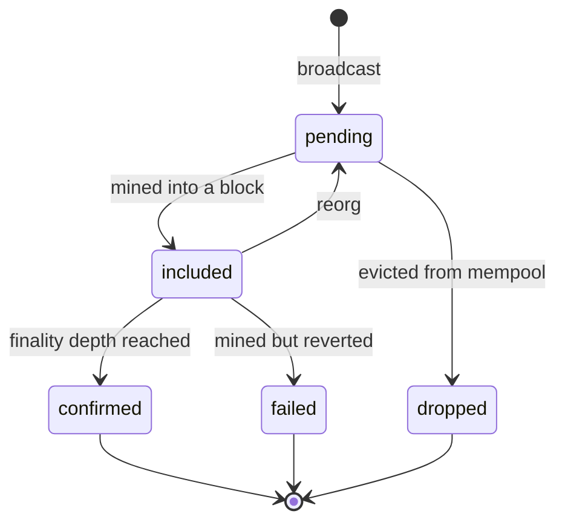

Arc settles the middle leg of a corridor transfer on a blockchain. Which blockchain is a decision made **per transfer**, not wired into the system — and that is what "chain-agnostic" has to mean if it is to mean anything. Chain-agnostic does not mean chains are interchangeable; it means their differences are modelled, and the choice of which to use is evaluated on each transfer's requirements rather than baked in. This lives in `packages/chain` rather than in a service, because it is a shared primitive: the movement context needs it to settle, and the test suite needs it to inject failures.

---

## The seam

```ts
interface ChainDriver {
  broadcast(...): Promise<TxHash>;
  getTransaction(hash): Promise<ChainTransaction | undefined>;
  getConfirmations(hash): Promise<number>;
  estimateFee(...): Promise<Money>;
  head(): Promise<Block>;
  subscribe(handler: (event: ChainEvent) => void): Unsubscribe;
}
```

Six methods. Everything upstream codes against this interface, so swapping the simulator for a real RPC client — or an Anvil node, or a testnet — is a matter of writing another implementation, not of touching the saga.

<Note>
**Nothing in the movement context knows it is talking to a simulator.** That is the test of whether an abstraction is real: the code above it cannot tell what is below it.
</Note>

---

## Five chains that behave differently

This is where chain-agnosticism earns its keep. If all chains behaved the same, the abstraction would be decoration.

| Chain | Block time | Finality depth | Settlement window | Character |
| --- | --- | --- | --- | --- |
| Solana | 400 ms | 32 | ~13 s | Fastest; highest drop rate (mempool eviction) |
| Base | 2 s | 10 | 20 s | The default for speed-sensitive transfers |
| Tron | 3 s | 19 | 57 s | Cheap; the default when fee dominates |
| Ethereum | 12 s | 12 | 144 s | Slow blocks, shallow finality |
| Polygon | 2 s | 128 | **256 s** | Fast blocks, deepest reorgs, settles last |

**Polygon has blocks six times faster than Ethereum and settles nearly twice as slowly.** Fast blocks that are individually less secure need more of them to reach equivalent confidence.

<Note>
This is the single most useful thing the chain layer teaches. A system that models chains as "block time" gets this exactly backwards, and would route high-value transfers to the slowest-settling chain in the set while believing it had picked the fastest. The full story is [The fastest chain that settled last](/stories/the-fastest-chain-that-settled-last).
</Note>

Failure rates are per-chain too, not uniform noise: Solana has the highest drop rate, Polygon the deepest reorgs.

---

## Transaction states, and the distinction that matters



**`failed`** means mined, executed, reverted — and **gas consumed**. The fee is spent and irrecoverable.

**`dropped`** means the transaction never made it into a block. Cost nothing.

<Note>
**These are different terminal states and the difference is load-bearing.** Compensating for a failed transaction must not reverse the gas expense — the gas was really spent, and reversing it produces a balanced ledger that misstates reality. Arc's saga deliberately does not track the network-fee journal for exactly this reason.
</Note>

The `ChainEvent` union covers `block | included | confirmed | failed | dropped | reorg`. The `reorg` event carries `revertedTransactions`, so a consumer knows precisely what to undo without diffing state itself.

---

## Determinism

The whole simulator rests on one small file: **mulberry32** with an FNV-1a seed hash. Tiny, dependency-free, and identical across runs and platforms.

<Warning>
This is the only file in the repository permitted float arithmetic, with a scoped `eslint-disable` and a written justification. It is bit-mixing on a 32-bit state, not money, and nothing it produces becomes an amount without conversion to `bigint` minor units first.
</Warning>

The design decision that makes determinism actually hold is subtler than seeding the PRNG:

<Steps>
  <Step title="The outcome is decided at broadcast time, not at inclusion">
    Whether a transaction will be dropped, will revert, and how long it will be delayed are all rolled from the seeded RNG **when it enters the mempool**.

    If those rolls happened at inclusion, the results would depend on the order in which transactions were later queried — and a seeded run would stop being reproducible the moment a test read state in a different order.
  </Step>
  <Step title="Broadcast is idempotent by key">
    Rebroadcasting with the same idempotency key returns the original hash. This matches real client behaviour and Arc's own retry semantics — a retry that produced a second on-chain transaction would be a duplicate payment.
  </Step>
  <Step title="Block production drains the mempool with a bounded loop">
    Delayed transactions are pushed to the back rather than dropped, modelling a low-fee transaction waiting its turn. A `considered` counter bounds the loop so a mempool full of delayed transactions cannot spin forever.
  </Step>
</Steps>

---

## Reorgs, two ways

Rollback splices blocks off the chain, clears each affected transaction's block height, resets its status to `pending`, and places it at the front of the mempool so it is re-mined promptly. It returns the reverted hashes.

It can be triggered two ways, and having both is the point:

**Probabilistically, during `advance()`** — before each block, a roll against the chain's reorg rate, guarded so it cannot reorg past genesis. Realistic, and reproducible under a seed.

**Deterministically, via `forceReorg(depth)`** — the chaos suite needs a reorg at a *precise* moment. Tuning a probability until a test happens to reorg is flaky and proves nothing about the code path you meant to exercise.

<Note>
**A seeded run reproduces the same blocks, reorgs and transaction outcomes every time** — and a reorg rolls a mined transaction back to `pending` before it is re-mined. Both are asserted by test.
</Note>

---

## Chain selection

`selectChain` scores each available chain on settlement time and fee, weighted by a 0–100 `speedPreference`:

```text
score = normalise(settlementTime) × speedWeight
      + normalise(fee)            × (100 − speedWeight)
```

High speed preference picks Base. Low speed preference picks Tron. Both terms are normalised into comparable ranges before weighting, because adding seconds to gas units is meaningless otherwise.

<Warning>
**Deliberately simple.** Real routing would also weigh liquidity depth on the destination pair and current congestion, both of which move faster than the static characteristics here. The interface has room for both; the implementation does not have them yet.
</Warning>

This is what chain-agnostic settlement means concretely: the corridor evaluates per transfer instead of being wired to one chain, and swapping in a better scoring function does not touch the saga.

---

## How the saga uses it

The `settle` step does three things in a specific order, and the third is the one people skip:

<Steps>
  <Step title="Broadcast">
    With an idempotency key derived from the transfer, so a retry cannot double-send.
  </Step>
  <Step title="Advance the chain">
    Via an injected `advanceChain` function — the simulator has no wall clock, so time is something the caller supplies. This is also what makes a full settlement testable in milliseconds.
  </Step>
  <Step title="Re-read the transaction and require final">
    **Not** "no error was thrown". Checking `final` is the difference between confirming settlement and merely confirming submission — code that does the latter looks completely correct until the day a transaction is dropped.
  </Step>
</Steps>

<Warning>
The `settle` step's compensation is a **ledger-level** unwind representing funds recovered from the settlement partner. Nothing un-sends a confirmed on-chain transaction. That limitation is real, and it is stated here rather than papered over — an architecture that implies otherwise is lying about what a blockchain is.
</Warning>

<CardGroup cols={2}>
  <Card title="Next: the settlement saga" icon="rotate-left" href="/architecture/settlement-saga">
    Where the chain layer, the rails, and the ledger are assembled into a transfer.
  </Card>
  <Card title="Settlement and finality" icon="clock" href="/primer/settlement-and-finality">
    The domain background, if the finality-depth table above raised questions.
  </Card>
</CardGroup>
