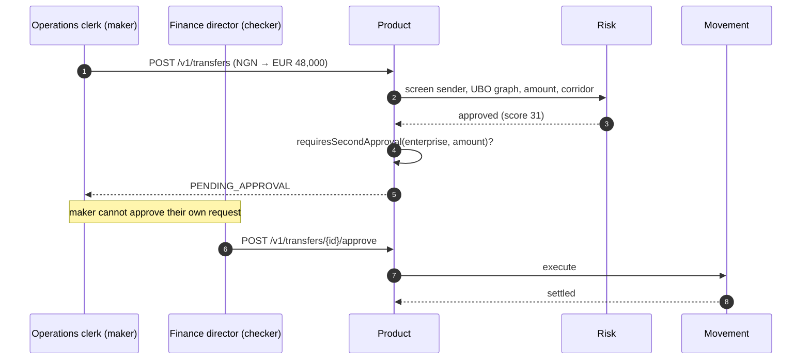

Kano Textiles imports industrial machinery from a German supplier. They owe €48,000 against an invoice due Friday. The rails that settle this payment are identical to those in the [consumer flow](/flows/consumer-remittance) — the same quote engine, the same swap logic, the same chain settlement. What differs is **policy**: KYB instead of KYC, a maker–checker approval queue, and SEPA Instant as the out-rail instead of mobile money. This page walks the full journey, highlighting every place where the enterprise surface diverges from the consumer one.

## What is different

| | Consumer | Enterprise |
| --- | --- | --- |
| Verification | KYC — passport, address, selfie | **KYB** — certificate of incorporation, UBO declaration, proof of address |
| Beneficial ownership | n/a | **UBO graph**, resolved recursively through holding structures |
| Approval | Sender alone | **Maker–checker** — second approver required, must be a different actor |
| Tier ceiling | €15,000 (Tier 2) | Unlimited (Tier 3); second approver above €100,000 |
| Transfer direction | Out of a funded balance | Fund a virtual account first, then instruct payment |
| Out-rail | Mobile money | **SEPA Instant** — €100,000 cap, no cut-off window |

## Funding first

Kano Textiles holds a **virtual NGN account** — a real-shaped NUBAN generated deterministically with a valid check digit, so a bank transfer to it looks like any other domestic Nigerian transfer.

<Note>
The NUBAN is Nigeria's 10-digit scheme: a 3-digit bank code plus a 9-digit serial, with a weighted check digit. Arc generates structurally valid identifiers rather than placeholder strings, so a payment looks like a payment and a tampered digit fails validation immediately. IBANs follow the same principle: real mod-97 check digits per ISO 13616, not padding.
</Note>

They transfer ₦75,000,000 from their corporate account via NIP — the Nigerian Interbank Payment system, which carries the **highest rejection rate** of the rails Arc simulates. Arc's rail adapter receives it and posts the funding journal:

| Account | Dr | Cr |
| --- | --- | --- |
| `asset.float.bank.NGN` | 75,000,000.00 | |
| `liability.customer.va_kano.NGN` | | 75,000,000.00 |

Both sides in a single entry. Arc gains an NGN asset — naira sitting at a partner bank — and simultaneously owes Kano Textiles the same amount. Pairing them is what makes "do we hold what we owe in NGN?" a query rather than a guess.

## The approval flow

<Note>
**The maker cannot be the checker.** The queue enforces that the second approver is a distinct actor from the first. This check is trivial to write and the single most common way maker–checker is quietly defeated in practice — allowing self-approval is a policy hole that typically lives undetected until an audit.
</Note>

`requiresSecondApproval` returns `false` immediately for personal accounts. A consumer sending money to family does not need a second approver, and encoding that as an early return keeps the intent visible at the call site rather than buried in a policy table.

## Compliance at enterprise scale

The same three checks run for every transfer. The weights and patterns differ because enterprise payment behaviour looks nothing like consumer behaviour.

<AccordionGroup>
  <Accordion title="KYB and the UBO graph" icon="sitemap">
    Ownership is resolved as a **graph**, not a flat list. Kano Textiles is owned by two holding companies, one of which is owned by three individuals. The beneficial owners are those individuals — none of whom appear on the first form anyone filed.

    Every resolved UBO is screened against the sanctions list, not just the operating company. An entity that screens clean while its ultimate owner does not is exactly the case the graph exists to catch. Stopping at the first layer of ownership would make the screen largely decorative.
  </Accordion>

  <Accordion title="AML rules on a business pattern" icon="chart-line">
    Enterprise flows look nothing like consumer flows, and the rules score accordingly. Large, infrequent, invoice-shaped payments to a small set of established suppliers are **normal** here and would be alarming from a personal account.

    What raises the score to 31: NG→DE is a corridor this account uses only a few times a year, and €48,000 is well above its median transaction size. Neither threshold is close to `reviewAt`. What would trip it: a sudden series of transfers to a **new** beneficiary, or a sharp shift in counterparty concentration within the observation window.
  </Accordion>

  <Accordion title="Tier 3 and source of funds" icon="file-invoice">
    Kano Textiles is Tier 3 — unlimited per-transfer ceiling, with a second approver required above €100,000. Reaching Tier 3 required a source-of-funds document in addition to the Tier 2 package.

    This transfer is below €100,000, so the second approver here is required by **enterprise policy**, not the tier threshold. Both rules exist and they compose: a Tier 3 enterprise transfer above €100,000 would trigger both, and both must be satisfied.
  </Accordion>
</AccordionGroup>

## The journals

The same five saga steps run, in the same order. The direction is reversed and the currencies change; the structure is identical to the consumer flow. Each tab shows the abbreviated journal — see the [consumer flow](/flows/consumer-remittance) for the full treatment of each step.

<Tabs>
  <Tab title="reserve">
    | Account | Dr | Cr |
    | --- | --- | --- |
    | `liability.customer.va_kano.NGN` | 74,120,000.00 | |
    | `liability.in_transit.NGN` | | 73,780,460.00 |
    | `revenue.fee.corridor.NGN` | | 118,540.00 |
    | `revenue.fee.fx_spread.NGN` | | 221,000.00 |
  </Tab>

  <Tab title="swap">
    | Account | Dr | Cr |
    | --- | --- | --- |
    | `liability.in_transit.NGN` | 73,780,460.00 | |
    | `equity.fx_position.NGN` | | 73,780,460.00 |
    | `asset.float.chain.USDC` | 52,180.00 | |
    | `equity.fx_position.USDC` | | 52,180.00 |
  </Tab>

  <Tab title="settle">
    | Account | Dr | Cr |
    | --- | --- | --- |
    | `equity.fx_position.USDC` | 52,180.00 | |
    | `asset.float.chain.USDC` | | 52,180.00 |
    | `asset.float.bank.EUR` | 48,000.00 | |
    | `liability.in_transit.EUR` | | 48,000.00 |
  </Tab>

  <Tab title="payout">
    | Account | Dr | Cr |
    | --- | --- | --- |
    | `liability.in_transit.EUR` | 48,000.00 | |
    | `asset.float.bank.EUR` | | 48,000.00 |

    Out via **SEPA Instant** to the supplier's IBAN. Instant settlement, always open, €100,000 cap — this transfer fits comfortably under the limit.
  </Tab>
</Tabs>

## The rail decision that would have cost a day

SEPA offers Arc two out-rails for EUR, and choosing the wrong one carries an asymmetric penalty that has nothing to do with the fee.

| Rail | Settlement | Cut-off | Submitted at 16:00 UTC |
| --- | --- | --- | --- |
| `sepa_instant` | Instant | None | Arrives in seconds |
| `sepa_credit` | Standard | 15:00 UTC | Queues to **tomorrow's opening**, then takes normal latency |

<Warning>
Missing a batch rail's cut-off by an hour costs a **day**, not an hour. The queued payment starts from the next opening *and then* takes the rail's normal settlement window — the delays compound. For an invoice due Friday submitted Thursday afternoon, that distinction is the whole product. That arithmetic is asserted by a test, not assumed. [The cut-off that cost a day →](/stories/the-cutoff-that-cost-a-day)
</Warning>

Arc selects `sepa_instant` when the transfer amount is under €100,000 and the rail is available, regardless of time of day. There is no cut-off to miss.

## Where the money ended up

| | After |
| --- | --- |
| Kano Textiles NGN balance | ₦880,000.00 remaining |
| Supplier EUR balance | €48,000.00 received via SEPA Instant |
| Arc revenue | ₦339,540.00 across two fee accounts |
| Every in-transit account | 0 |
| Trial balance, every currency | **0** |

Total cost to Kano Textiles: roughly **0.46%** of the invoice — materially cheaper than the consumer rate, because the fixed component is amortised over a much larger amount and the corridor fee is basis-point based. That asymmetry is real and is why enterprise and consumer are different products built on one set of rails.

<CardGroup cols={2}>
  <Card title="Consumer remittance" icon="user" href="/flows/consumer-remittance">
    The same rails from the other direction: EUR in, M-Pesa out, no approval queue.
  </Card>
  <Card title="A reversal, in full" icon="rotate-left" href="/flows/reversal">
    What happens when the supplier's IBAN is closed and the payout is rejected.
  </Card>
</CardGroup>
