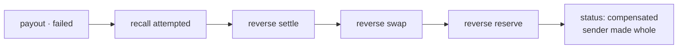

Everything went right until the last step. The chain settled, Arc holds KES float, and the beneficiary's M-Pesa number turns out to be deregistered. The rail rejects. This page walks what happens next — four compensating journals, posted in reverse order, that bring every account back to exactly where it was before Amina initiated the transfer. This is the same €1,000 from the [consumer flow](/flows/consumer-remittance), failed at `payout`.

## Why reversals work

A reversal is the exact opposite journal: every debit becomes a credit, every credit becomes a debit, same accounts, same amounts. Because the original entry balanced — debits equalled credits — the reversal balances too. This is not a property that needs to be carefully maintained; it is a consequence of arithmetic. A compensation path that posts the correct opposite entry **cannot** unbalance the ledger, regardless of what went wrong before it ran.

The pair also nets to zero. Every account touched by the original journal returns to precisely its prior balance, which is what "the sender ends where they started" actually means in ledger terms.

## What has already happened

Four journals were posted before the failure. Three of them are tracked for compensation.

| # | Step | Journal | Tracked for reversal? |
| --- | --- | --- | --- |
| 1 | `reserve` | Sender debited, fees split out | yes |
| 2 | `swap` | EUR obligation → USDC asset | yes |
| 3 | `settle` | USDC out, KES float in | yes |
| 3b | `settle` | Network fee: Dr expense, Cr chain float | **no** |
| 4 | `payout` | — rejected before posting | n/a |

<Warning>
The network-fee journal is deliberately **not tracked** and therefore never reversed. Gas was genuinely spent. Reversing it would produce a balanced ledger that misstates a real expense — and where "balanced" and "true" pull apart, true wins. The gas journal balances on its own, so the trial balance stays zero regardless.
</Warning>

## The rail says no

```text
RailError {
  code: 'account_closed',
  retryable: false,
  message: 'beneficiary MSISDN is deregistered'
}
```

The `retryable` field decides everything that follows.

<Tabs>
  <Tab title="retryable: false">
    **A rejection is definitive.** Resubmitting `account_closed` fails again, more slowly. The saga stops trying and begins unwinding immediately.
  </Tab>
  <Tab title="retryable: true (a timeout)">
    **A timeout is ambiguous.** The payout may or may not have landed — and that ambiguity is the entire reason idempotency keys exist. Resubmit with the same key; the rail returns the original receipt if it already processed the payment, and processes it fresh if it did not. No double payment, no silent loss.
  </Tab>
</Tabs>

## Compensation, backwards



The saga walks **completed** steps in reverse order. `payout` never completed, so there is no payout journal to reverse — but the rail recall is still attempted, because the saga cannot assume the submission left no trace at the rail.

<Note>
`recall` returns `false` once the settlement window has passed. You cannot recall settled funds, and pretending otherwise would let the saga believe it had unwound something it had not. In this case the payout was rejected outright, so there is nothing at the rail to recall.
</Note>

### 1 · Reverse `settle`

Every direction flipped, same accounts, same amounts:

| Account | Dr | Cr |
| --- | --- | --- |
| `asset.float.chain.USDC` | 1,072.35 | |
| `equity.fx_position.USDC` | | 1,072.35 |
| `liability.in_transit.KES` | 138,254.00 | |
| `asset.float.bank.KES` | | 138,254.00 |

<Warning>
This is a ledger-level compensation, not an on-chain reversal. It represents funds recovered from the settlement partner. Nothing un-sends a confirmed on-chain transaction — that limitation is real and is stated rather than papered over.
</Warning>

### 2 · Reverse `swap`

| Account | Dr | Cr |
| --- | --- | --- |
| `equity.fx_position.EUR` | 989.09 | |
| `liability.in_transit.EUR` | | 989.09 |
| `equity.fx_position.USDC` | 1,072.35 | |
| `asset.float.chain.USDC` | | 1,072.35 |

Both FX position accounts return to zero. The open exposure this transfer created is closed.

### 3 · Reverse `reserve`

| Account | Dr | Cr |
| --- | --- | --- |
| `liability.in_transit.EUR` | 989.09 | |
| `revenue.fee.corridor.EUR` | 4.85 | |
| `revenue.fee.fx_spread.EUR` | 6.06 | |
| `liability.customer.va_amina.EUR` | | 1,000.00 |

**The fees are reversed too.** Amina is refunded €1,000.00 — the full amount, not the net-of-fees amount. Arc absorbs the cost of a failed transfer, which is both the correct commercial position and the only one that keeps the arithmetic clean. Returning anything other than the full debit would leave a residual in revenue that represents money never earned.

## Why the order matters

For the ledger alone, order is irrelevant. Reversals commute — addition commutes — and running the same compensating entries in any order produces identical final balances. Every test stays green.

Order matters for two reasons that balance checks cannot detect:

<Steps>
  <Step title="The rail recall must precede the settlement unwind">
    Unwinding the settlement journal while a payout might still be in flight at the rail risks recovering funds you are simultaneously paying out. The recall attempt and its result must be recorded before the books show those funds returned.
  </Step>
  <Step title="Each reversal journal must describe the step it actually undoes">
    Compensating in forward order would produce a journal labelled "undo reserve" that actually reverses the *payout* entries. The ledger balances. The audit trail is false. A false audit trail discovered during a dispute investigation is a worse outcome than a failed transfer.
  </Step>
</Steps>

<Note>
Switching to forward order kept all sixteen balance tests green — balance cannot detect it. Two additional tests asserting reversal order and account pairing were added; the mutant now fails. **Balance is necessary but not sufficient. An audit trail can be false while the arithmetic is true.** [The journal that balanced and lied →](/stories/the-journal-that-balanced-and-lied)
</Note>

## The final state

| | Before the transfer | After the unwind |
| --- | --- | --- |
| Amina's EUR balance | €1,000.00 | **€1,000.00** |
| `liability.in_transit.EUR` | 0 | 0 |
| `liability.in_transit.KES` | 0 | 0 |
| `equity.fx_position.EUR` | 0 | 0 |
| `equity.fx_position.USDC` | 0 | 0 |
| `revenue.fee.corridor.EUR` | 0 | 0 |
| `revenue.fee.fx_spread.EUR` | 0 | 0 |
| `expense.network_fee.ETH` | 0 | **0.000018 ETH** |
| Trial balance, every currency | 0 | **0** |

Everything is back to zero except the gas, which was genuinely spent and stays on the books as an expense Arc absorbed. `SagaResult.status` is `compensated`. Amina receives a notification explaining the beneficiary number is invalid, and the entry log contains the full sequence — what was attempted, what succeeded, and exactly how each step was undone.

## When compensation itself fails

The `compensation_failed` terminal state exists for a reason.

<Warning>
If a reversal step throws, the saga returns `compensation_failed` and **stops** rather than retrying blindly into a partially-unwound state. That status is distinct from `compensated` precisely so it can be alerted on and routed to a human operator with the full step record attached.

A partially-compensated transfer requires manual intervention. The saga will not attempt to guess which steps it managed to undo — it records where it stopped and waits.
</Warning>

<CardGroup cols={2}>
  <Card title="The settlement saga" icon="arrows-rotate" href="/architecture/settlement-saga">
    The mechanism this page exercises — how each step, compensation handler, and terminal state is wired together.
  </Card>
  <Card title="The journal that balanced and lied" icon="book" href="/stories/the-journal-that-balanced-and-lied">
    The full story of how forward-order compensation passed every balance test and still produced a false audit trail.
  </Card>
</CardGroup>
