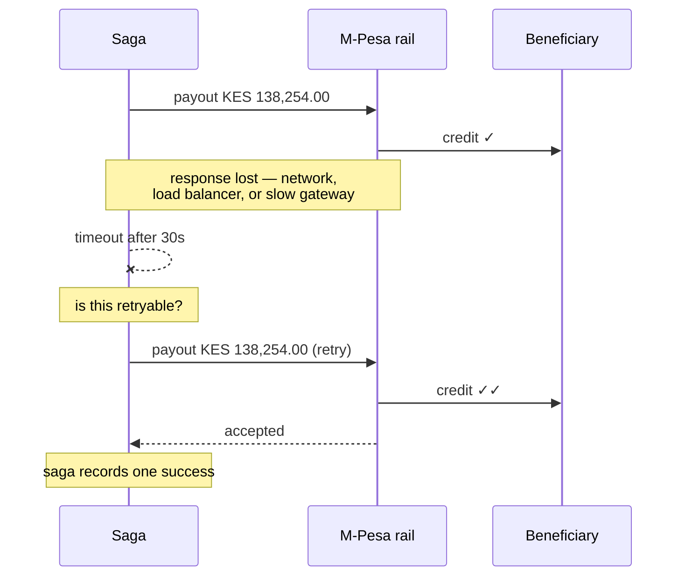

A beneficiary in Nairobi received KES 138,254.00 twice, four seconds apart, for a transfer the sender made once. The Arc ledger shows one transfer and one payout entry. The rail's reconciliation statement shows two credits. Nothing in the system logs looks like an error — the retry that caused the duplicate is logged at `info` level, because from the saga's perspective, it worked.

<Warning>
**Symptom:** Beneficiary received KES 138,254 twice, four seconds apart. Ledger shows one payout. Rail statement shows two. No errors logged. The retry completed successfully and so, it turned out, did the original request.
</Warning>

## The sequence



The timeout is the entire problem — and it is not a failure. **A timeout is not a failure.** It is the absence of information about whether something succeeded. The rail credited the beneficiary. The response was lost somewhere between the rail and the saga. The saga knows only that 30 seconds passed without a response.

<Note>
**The saga has exactly two options after a timeout and both are wrong without more machinery:** retry and risk paying twice, or give up and risk stranding funds the rail already sent. There is no third option that is safe by reasoning alone.
</Note>

## Three wrong fixes

<AccordionGroup>
  <Accordion title="Don't retry timeouts" icon="ban">
    Now a network blip strands a transfer in an unknown state. Someone must reconcile it by hand against the rail's statement, and until they do, the customer's money is neither sent nor refunded.

    This converts a rare double-payment into a common manual-intervention case. Worse trade.
  </Accordion>
  <Accordion title="Query the rail before retrying" icon="magnifying-glass">
    Better instinct, and still broken. The query has the same failure mode as the payout: it can time out. There is also a window between the query returning "not found" and the retry landing, in which the original response could arrive.

    You have made the race condition narrower, not eliminated it. Narrower races are harder to reproduce and just as expensive when they occur.
  </Accordion>
  <Accordion title="Deduplicate on amount and beneficiary" icon="equals">
    Then a customer who legitimately sends their relative KES 138,254.00 twice in one day has their second transfer silently swallowed. Deduplicating on the **data** rather than on **identity of intent** always breaks on legitimate repetition.
  </Accordion>
</AccordionGroup>

## The actual fix: the caller supplies identity

The retry is not a new instruction. It is *the same instruction, sent again* — and the only party who knows that is the caller. So the caller says so explicitly, with an **idempotency key** derived from the transfer id:

```ts
await rail.submit({
  idempotencyKey: `payout:${transferId}`,
  amount,
  beneficiary,
});
```

<Note>
**Resubmitting with the same key returns the original receipt rather than paying twice.** The rail — not the saga — becomes responsible for recognising a repeated instruction, because the rail is the only party that knows whether it already acted on this specific intent.
</Note>

This guarantee must hold at every layer in the system that can retry, not just the outbound payout call:

| Layer | Key derived from | What it guarantees |
| --- | --- | --- |
| Public API | Client-supplied `Idempotency-Key` header | The same transfer request cannot create two transfers |
| Rail adapter | Transfer id | The same payout cannot be submitted to the rail twice |
| Chain broadcast | Transfer id | Rebroadcast returns the original transaction hash rather than a second transaction |
| Event handlers | Event id | A redelivered message queue event is not processed twice |

Arc's chain simulator implements idempotency deliberately — `broadcast` is idempotent by key, matching real-world client behaviour. A retry that produced a second on-chain transaction would be a duplicate payment with no recall path at all.

## Retryable is a field, not a guess

The second half of the fix is knowing **when** to retry. Most implementations reach for a heuristic on the error message string. Arc puts it in the type:

```ts
class RailError extends Error {
  readonly code: string;
  readonly retryable: boolean;
}
```

<Tabs>
  <Tab title="Timeout → retryable: true">
    The payout may or may not have landed. That ambiguity is the entire reason idempotency keys exist. Retry with the same key; the rail resolves the uncertainty. Giving up here risks stranding funds that were already sent.
  </Tab>
  <Tab title="Rejection → retryable: false">
    `account_closed`, `invalid_beneficiary`, `compliance_hold`. Retrying will fail again, more slowly, while the customer waits. The saga should unwind and surface the error instead.
  </Tab>
</Tabs>

<Note>
**Making retryability a field on the error rather than a decision at the call site** means the rail adapter — the only component that understands the rail's semantics — decides once, in one place. M-Pesa has the highest timeout rate of the rails Arc simulates. NIP has the highest rejection rate. Those are different failure profiles requiring different handling, and a system treating all rail errors identically handles both badly.
</Note>

## The recall trap

When a transfer must unwind after a successful payout, the saga attempts a **recall**. This has its own honesty requirement:

```ts
recall(receipt): boolean  // returns false once past settlesAt
```

<Warning>
**You cannot recall settled funds.** `recall` returns `false` once the transfer is past its `settlesAt` timestamp. The saga must handle `false` explicitly rather than assuming recall always succeeds — because assuming otherwise would let the saga believe it unwound something it did not. A ledger showing money returned that is sitting in a stranger's mobile-money wallet is a more serious problem than a failed saga.
</Warning>

## The lesson

<Steps>
  <Step title="A timeout is missing information, not a failure">
    Design for "I do not know" as a first-class outcome. Every distributed system has this state, and most codebases model it as an exception — which is exactly the modelling that discards the information.
  </Step>
  <Step title="Idempotency is the caller's responsibility to declare, the receiver's to honour">
    Only the caller knows two requests represent the same intent. Only the receiver knows whether it already acted. The idempotency key is how that knowledge crosses the service boundary.
  </Step>
  <Step title="Deduplicate on identity of intent, never on data">
    Amount plus beneficiary plus timestamp is a heuristic that breaks on legitimate repetition. A key derived from the transfer id is a fact about intent.
  </Step>
  <Step title="Encode retryability in the type system">
    A boolean field on the error, set by the component that understands the rail's semantics — not a regex on the error message at the call site.
  </Step>
</Steps>

<CardGroup cols={2}>
  <Card title="The Settlement Saga" icon="rotate-left" href="/architecture/settlement-saga">
    Rails, idempotency, and the `retryable` field in full context.
  </Card>
  <Card title="The Cut-Off That Cost a Day" icon="clock" href="/stories/the-cutoff-that-cost-a-day">
    Next: a payout that was not late by an hour, but by a day.
  </Card>
</CardGroup>
